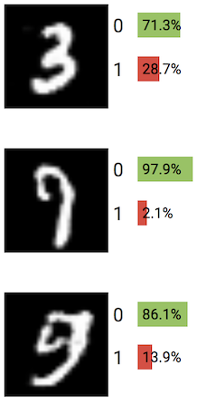

# Assignment 11: Generative Adversarial Networks

Adapted by Mark Sherman <shermanm@emmanuel.edu> from MIT 6.S198 under Creative Commons
Emmanuel College - IDDS 2132 Practical Machine Learning - Spring 2022

This assignment is based on work by Kevin Doherty, Efraim Helman, Natalie Lao, and Hal Abelson.

This week's unit covers GANs, an architecture that builds upon the concept of generative models to create better machine generated objects via two networks working in parallel against each other. 

# 0. Introduction to GANs

The above images, though realistic, are entirely synthetic (check out some of the ears for example); they have been produced as a function of random noise by a generative adversarial network, or GAN. Originally proposed in 2014, GANs have come a long way to be able to produce these images. In this assignment, we’ll start from the original GAN formulation and work our way toward the current state-of-the-art GAN formulations.

In the original formulation of a GAN, we have two networks: the **generator** and the **discriminator**. The goal of the discriminator is to differentiate between real data from a source dataset and synthetic data produced by the generator. At the same time, the generator seeks to produce data is realistic enough to fool the discriminator. 

Both the generator and discriminator are neural networks that may consist of any of the layers we have seen so far in combination. More specifically, the generator `G` is a neural network that takes as input a source of random noise `z` in order to produce an output that “looks like” real data `x`. The random noise `z` is used to produce different images on each run. The discriminator `D` is a neural network that takes a input a mixture of real images and images coming from the generator.  It produces a probability estimate that the data is real, i.e. not synthesized by the generator. Training the generator and the discriminator in this sort of competitive framework has resulted in dramatic improvements in the area of generative models, but as we will see, they are not without their challenges.

# 1.1 Exploring the GAN Playground

Now that we have a basic idea of the dueling network architecture of a GAN, we can experiment with our own GANs to try to understand some of their capabilities and some of the challenges with their use. The first thing we’ll do is build a GAN and use it to generate fake MNIST digits.

Navigate to the GAN Model Builder: https://reiinakano.github.io/gan-playground/

Notice how on this model builder, there are two networks defined: the Generator and the Discriminator, as discussed above. When the system starts, both networks have convolutional layers.  To the right of the layers, there are two columns displaying images, the first displaying real MNIST images, and the second displaying ones generated by the generator.   

The generated images should currently just be random grey patches because the generator has not yet been trained.

Click on the Train button in the Data column and let it run for a few thousand examples.  The rightmost column displays training statistics.

After about 10,000 examples, your generated images should start getting "blotchy", with clear shapes beginning to appear:

Notice that each image is labeled with "0" or "1" instead of 0-9 like the previous classifier examples. The percentage after "0" describes the probability with which the discriminator thinks that the image is fake/a generated image. The "1" describes the probability that it's a real image from the MNIST dataset. Green indicates that the label is correct for that image. (i.e. it really is a fake image) and red indicates that the label is incorrect for that image.

After about 25,000 iterations, you should be able to see images that actually seem to resemble numbers:

## Problem 1

> How long did it take to start to see real numbers? (In examples trained)
>
> Which numbers started to emerge first? Why do you think that is?

# 1.2 Changing the Model

Reload your browser page.

Using  the Model menu in the DATA (leftmost) column, change the Discriminator and Generator models from Convolutional to Fully connected.   

Each of the two new models has two FC layers with a ReLU activation,  together with additional layers that are needed to fit things together.

For the discriminator, we need to flatten the [28,28,1] input image to produce an output shape of [784] which is then fed to the FC layer with 128 hidden units.   A second FC layer transforms the [128] shape to the [2] shape of the label layer.  These output labels reflect the probability that the image fed to the input layer is real vs. the probability that it is fake, hence the name Discriminator.

The Generator's input has shape [100]: it's a vector of noise sampled from a uniform distribution that provides the “seed” for the image. The Generator’s job is to massage this input into a realistic image, a goal that is somewhat similar to the style transfer network we saw in Assignment 3. The output for the generator has shape [28,28,1], representing a 28x28 monochrome image, hopefully of an MNIST digit. The Tanh layer preceding it is used to force incoming values into a valid grayscale pixel range of 0 to 1.

We also need the reverse of a Flatten layer to go from our flat input to a multi-dimensional output:
This layer is called a Reshape layer.  Given an input, it will reshape it to the described shape, as long as the total number of input and output values match.

## Problem 2

Why does the Generator need the second FC layer to transform the shape [256] output of the first FC layer?  

Hint:  Can a Reshape layer reshape [600] to [20,20,2]? How about [800] to [20,10,4]?

> Your answer

# 1.3. Continuing
Hit Train the train button and let the GAN train.

Somewhat reasonable results should appear within 10-15 minutes, and you can expect results like this between iterations 200,000 and 300,000:

## Problem 3
Add screenshots of some results (generated examples, discriminator predictions on real and fake data, and learning curves as in the plots above).

> Your screenshots, with their descriptions, here. Feel free to add any other observations you think are interesting. 

## Problem 4
Can you say anything about the performance of the system's default fully connected model versus the performance of the convolutional model? 

> Your response here.

# 1.4. Exploring with the GAN Playground 

Play try some variations of the default models for the Discriminator and Generator.  You can add or change layers and play with hyperparameters like learning rate and optimizer (e.g., try adams rather than simple gradient descent -- sgd).  One particular direction you might explore is to investigate the effect of changing the learning rates of the Discriminator and Generator, e.g., try 0.1 rather than 0.01.

## Problem 5 
Submit screenshots of your results with at least 3 different configurations (architecture, learning rate, optimizers). At a minimum, try: the provided architecture with generator learning rate greater than discriminator learning rate, same architecture with discriminator learning rate greater than generator learning rate, and one other variant. Feel free to experiment with other layer types as well. No need for all your results to look great.  Keep in mind that you'll probably need to run each of your experiments for several minutes or longer, so don't feel the need to got overboard trying lots of variations.

> Insert your screenshots and results here. 

## Problem 6
Were any of your models able to generate any reasonable MNIST digits? If so, were any of your models able to generate all of the MNIST digits (0-9)? Did any of your models get stuck at some point generating one or a few digits only (i.e. mode-collapse)?

> Your response here. 

## Problem 7
What happened when the discriminator learning rate was greater than the generator learning rate? What about when the generator learning rate was greater than the discriminator learning rate?

> Your response here. 

## Problem 8
Try building configurations for CIFAR. (This will require a minute or two to load.)

First, try running with only FC layers for ~15 minutes and document your results.

> Your response here. 

## Problem 9* (Optional)
Optional Challenge: Try to build something that can generate somewhat reasonable fake CIFAR images. Document what you did. Provide screenshots, of course, of the final product. 

Hint: You may need to have this run overnight. Below are some images we were able to generate from CIFAR:

# Submission
Add your to this README.md file. Add images to the repository folder. Commit all files for submission and push back to GitHub Classroom.

# Copyright
This work has been adapted under a Creative Commons Attribution-ShareAlike 4.0 International License
© 2018 Massachusetts Institute of Technology